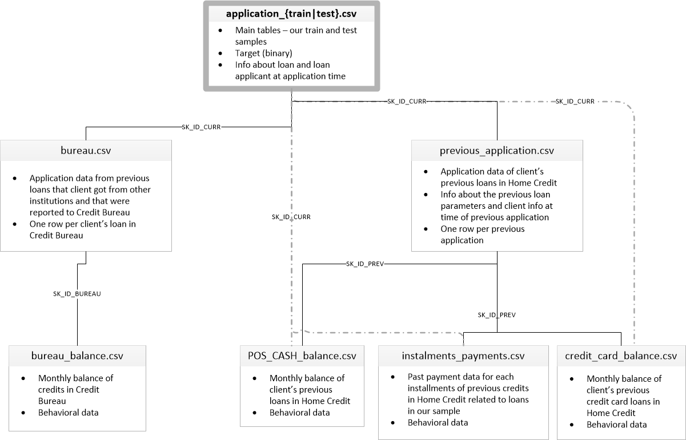

!
<!-- Set up & pull the data
Install pandas, numpy, scikit-learn, xgboost or lightgbm, imbalanced-learn, shap, fastapi, streamlit, joblib. Use the Kaggle API (kaggle competitions download -c home-credit-default-risk) to grab all the CSVs: application_train/test, bureau, bureau_balance, previous_application, POS_CASH_balance, credit_card_balance, installments_payments. Some of these run into millions of rows, so work in a Kaggle Notebook (free 16GB RAM) rather than a weak local machine. -->
<!-- 2 -->
<!-- EDA on the main table only
Explore application_train.csv in isolation first: confirm the 92:8 TARGET imbalance yourself, plot a missing-value heatmap, split numeric vs categorical columns, check correlation of top numeric features with TARGET. Get a feel for what you're predicting before touching the other tables. -->
3 -->
Aggregate and join the auxiliary tables
This is the core skill the project teaches. For bureau, previous_application, POS_CASH_balance, credit_card_balance, and installments_payments: groupby SK_ID_CURR and aggregate with mean/sum/count/min/max, giving one row per client per table. Merge all of those onto application_train on SK_ID_CURR. You'll go from 8 disconnected tables to one modeling-ready dataframe.
4
Build the preprocessing pipeline
Use sklearn's Pipeline + ColumnTransformer: SimpleImputer for missing values (median for numeric, most-frequent or a new 'Missing' category for categorical), StandardScaler for numeric columns, OneHotEncoder for low-cardinality categoricals. This single step closes your scaling, Pipeline, and ColumnTransformer gaps at once.
5
Handle the class imbalance
Don't reach for oversampling first. Try scale_pos_weight (XGBoost/LightGBM) or class_weight='balanced' (sklearn models) before SMOTE from imbalanced-learn. Evaluate everything on ROC-AUC and PR-AUC, never plain accuracy — 92% accuracy is trivial by always predicting 'no default'.
6
Train baseline through ensemble
Logistic Regression first as your true baseline, then Random Forest, then LightGBM or XGBoost (this is a classic gradient-boosting-wins dataset). Try PCA on the numeric block as a side experiment against your full feature set. Finish with a Voting or Stacking ensemble of your top 2-3 models — this closes your ensemble gap directly.
7
Tune and build the full eval notebook
Run RandomizedSearchCV on your best single model (faster than GridSearchCV given how many engineered features you'll have). Then build the evaluation notebook you're missing: ROC-AUC curve, confusion matrix, precision/recall/F1, and a SHAP summary plot for feature importance — SHAP matters here specifically since 'why was this application rejected' is a real question in credit risk interviews.
8
Deploy it
Pickle or joblib-save the full pipeline (preprocessing plus model) as one object so inference doesn't need to reimplement steps 3-4 by hand. Wrap it in FastAPI with an endpoint that takes applicant details and returns default probability, then put a Streamlit front-end on top for a live demo — same stack you already used for the Carbon Emission project.